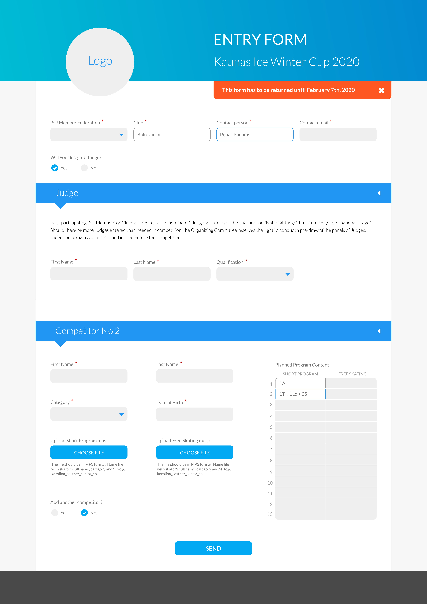
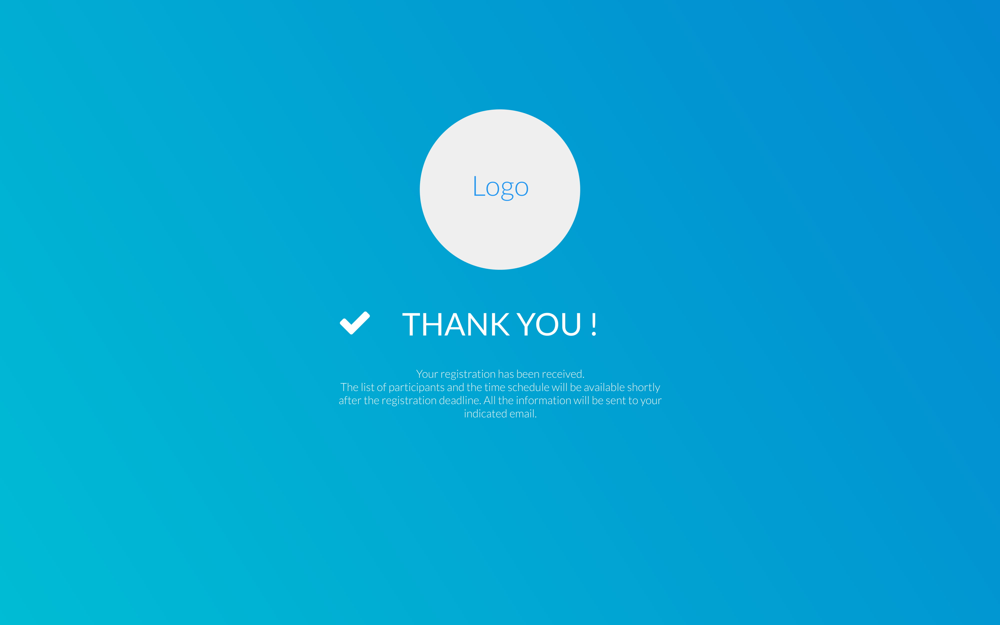
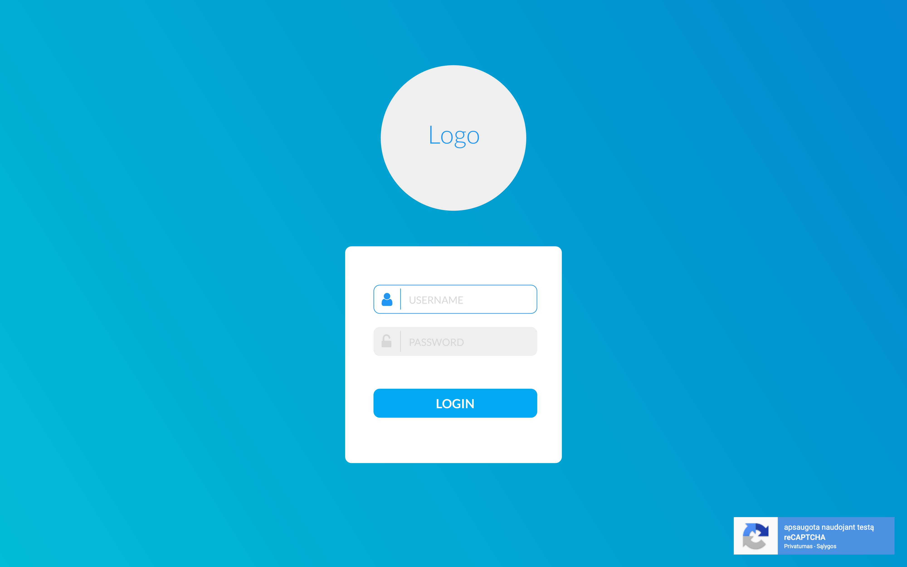
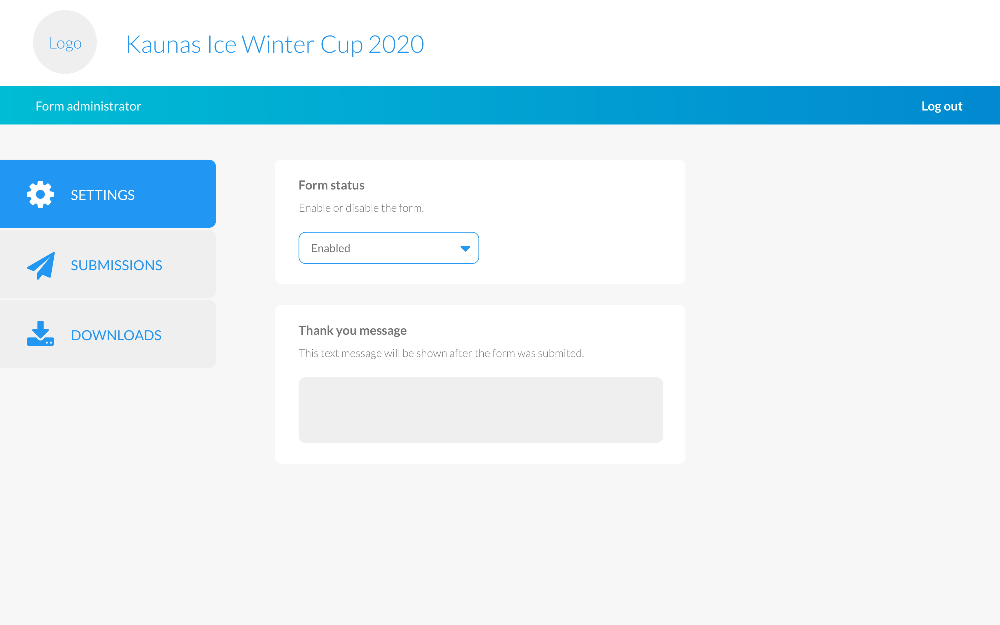
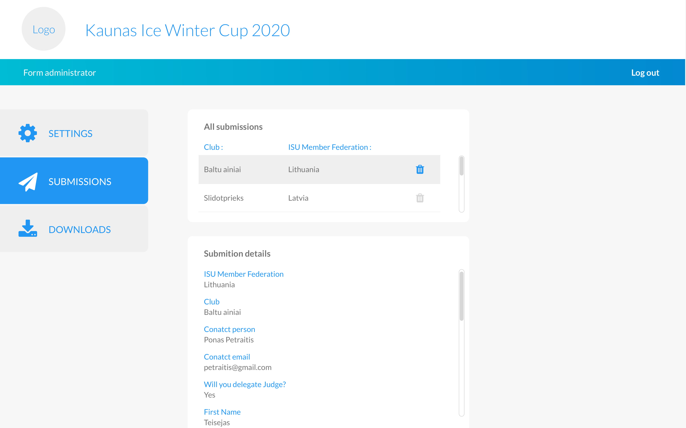
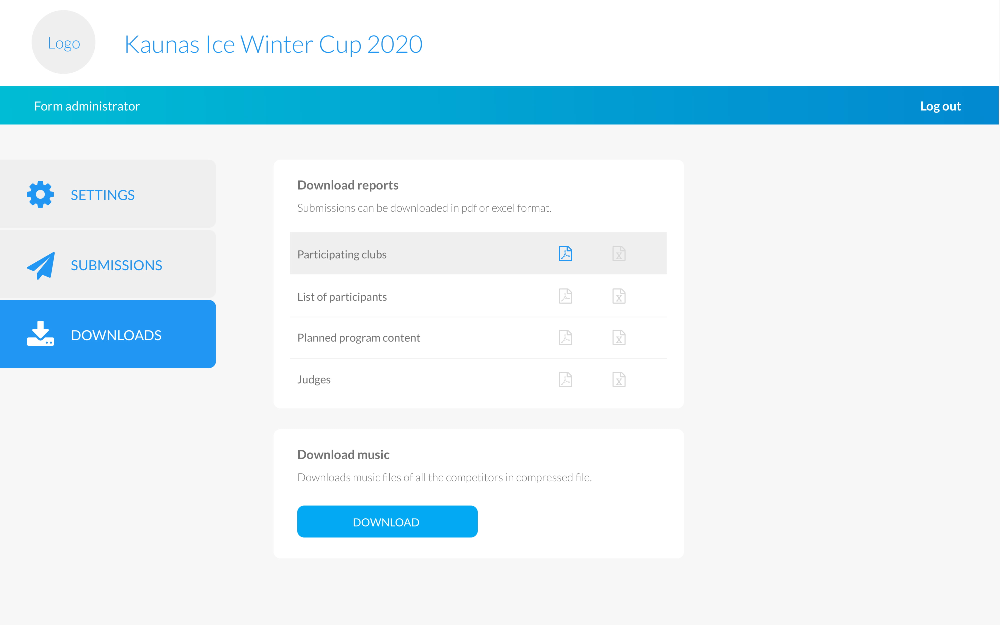

# Registration Form for Figure Skating Competition

Final project of Full-Stack courses in Kaunas Coding School.
The idea was to build the registration form for skaters to register to real Figure Skating Competition, which I organise :) [This is the link to competition site](http://www.kaunasice.lt/)
Project contains a registration form page, a thank you page, login page for form administrator and form administrator page. Unfortunately not fully finished.

Registration form page available here: https://justina-m.github.io/project-registration-form/

Technologies and tools used: HTML, SASS, JS, jQuery, PHP, npm

Idea, design, architecture and codebase created by Justina-M.

Below is the planned design of the project

